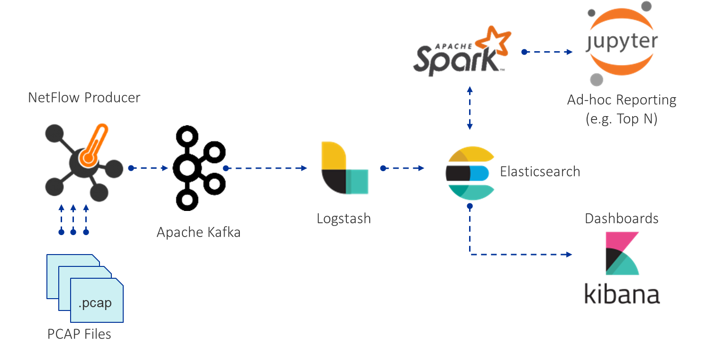

# ELK-SJ
The Elastic Stack (ELK) with Spark (S), Jupyter (J) and Network tools (nProbe, Tcpreplay and Tshark)

## Goal
To make it just as easy to analyze data as it is to collect it. 

## Features
* **Kafka**: A distributed event streaming platform capable of handling trillions of events a day
* **FileBeat**: A lightweight single-purpose data shipper from Elastic
* **Elasticsearch**: A highly scalable search and analytics engine
* **Logstash**: A dynamic data collection pipeline with an extensible plugin ecosystem.
* **Kibana**: An analytics and visualization platform designed to work with Elasticsearch.
* **ES-Hadoop**: A library that allows Hadoop jobs (& therefore Spark) to interact with Elasticsearch.
* **Spark**: A fast and general-purpose cluster computing system. It provides high-level APIs in Scala, Python and R.
* **GraphFrames**: A package for Apache Spark which provides DataFrame-based Graphs.
* **Jupyter Notebook**: A web application that allows you to create interactive notebooks. 
* **nProbe**: A software NetFlow v5/v9/IPFIX probe able to collect, analyze and export network traffic reports using the standard Cisco NetFlow v5/v9/IPFIX format. License is needed or else nProbe will run only in Demo mode. For more info visit: https://www.ntop.org/products/netflow/nprobe/ 
* **Tcpreplay**: A suite of free Open Source utilities for editing and replaying previously captured network traffic. 
* **Tshark**: A network protocol analyzer. It lets you capture packet data from a live network, or read packets from PCAP files. 

## Preparation
The only major modifications needed are:
1. Remove and replace the elasticsearch index templates
    * Located in `ELK-SJ/elasticsearch/output_templates`

2. Remove and replace the logstash conf files
    * Located in `ELK-SJ/logstash/pipelines`

3. Either add the files to analyze into `ELK-SJ/filebeat/input_files` or configure Kafka/FileBeat to ingest files for your use-case, or license nProbe and use it to feed Kafka with NetFlow data.

4. A few PCAP files for demo purposes can be downloaded from [TCPreplay web page] (https://tcpreplay.appneta.com/wiki/captures.html#contributions)

## Running
1. Easy! `docker-compose up`

If you'd like to have the containers running in the background:
`docker-compose up -d`

## Other Notes
* Kafka listens on port 9092
* Kibana uses 5601 (Access it via localhost:5601)
* Jupyter uses 8888 (Access it via localhost:8888)
  *  By default, Jupyter notebooks password is 'net-research'. This can be changed in the docker-compose file.
  

## TODO
* Password protect ES/Kibana

## Worthy mentions
* Project is mostly cloned from [RELK by kpolley] (https://github.com/kpolley/RELK)
* The inspiration: [HELK -- The Hunting Elastic Stack](https://github.com/Cyb3rWard0g/HELK)
* [Jupyer/Docker Stacks](https://github.com/jupyter/docker-stacks). An excellent repository with a ton of plug-and-play notebooks. It is incredible how easy it is to set up.
* [Docker @ Elastic](https://www.docker.elastic.co/): Plug-and-play docker containers for Beats, Logstash, Elasticsearch, and Kibana.
* [Tcpreplay by Fred Klassen and AppNeta] (https://tcpreplay.appneta.com/):Tcpreplay - Pcap editing and replaying utilities
* [TShark - part of the Wireshark distribution] ( https://www.wireshark.org): Dump and analyze network traffic
* [nProbe by Luca Deri] (https://www.ntop.org/products/netflow/nprobe/): A software NetFlow v5/v9/IPFIX probe